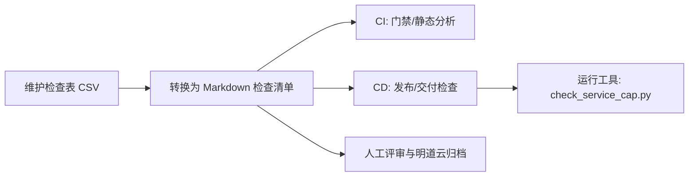
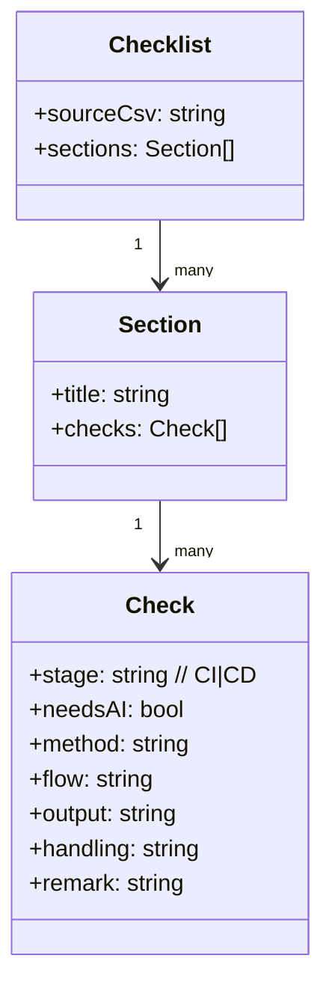

# 架构设计

## 目标

- 以 CSV 作为单一事实源维护 DBus 安全检查项。
- 产出可执行的 Markdown 检查清单，支撑 CI/CD 门禁与人工评审落地。
- 提供最小可用的自动化工具，降低关键检查项的人工成本与漏检风险。

## 产物与边界

- 输入：`DBus 安全检查-工作表1.csv`
- 输出：`DBus 安全检查-检查清单.md`
- 工具：`tools/check_service_cap.py`（检查单个 systemd service 的 Cap/User/Group）
- 过程性文档：`doc/changelog.md`、`.codex/plan/DBus安全检查清单转换.md`、`.codex/plan/systemd-service-cap检查工具.md`

## 流程视图（UML/mermaid）

## 数据模型（UML/mermaid）

## 关键约定

- CSV 中“检查项”为空的行，视为上一条检查项的子检查条目。
- Markdown 中以 `- [ ]` 作为最小执行单元；字段缺失时不输出该字段，避免引入推断信息。
